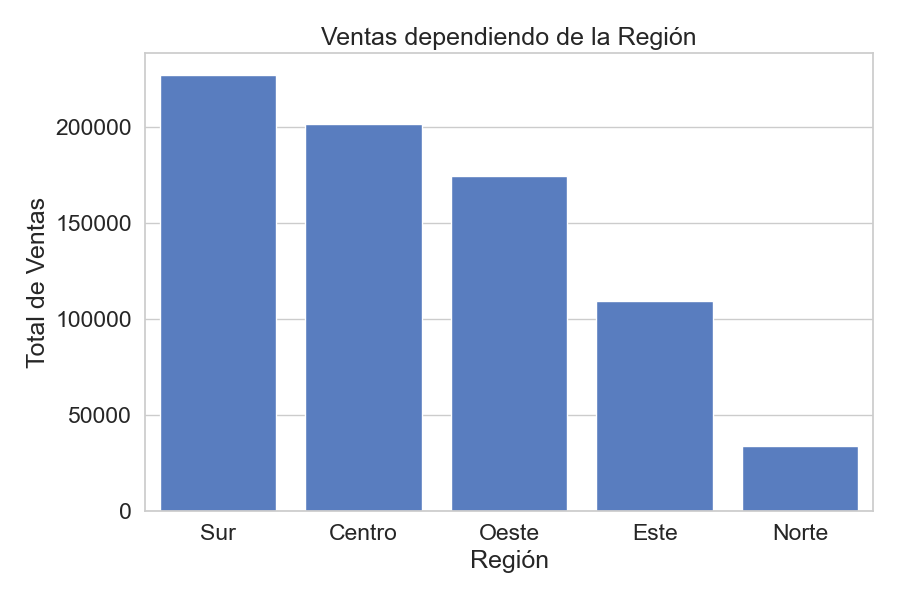
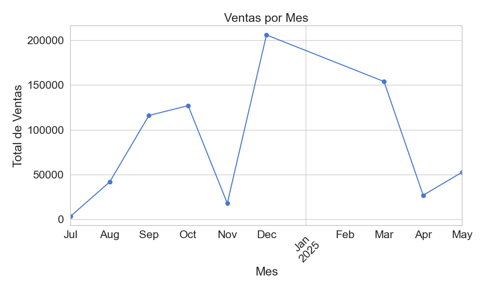
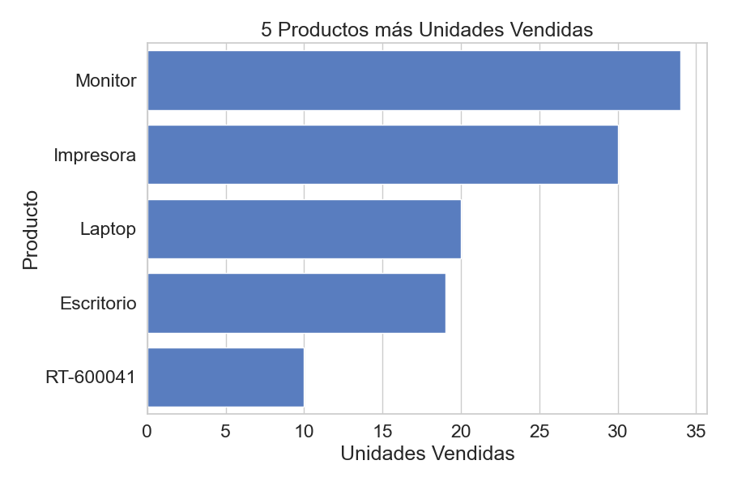

# Proyecto 1 — Análisis de Ventas de Negocio (End-to-End)


Este proyecto fue desarrollado como parte de mi formación en Ciencias Genómicas. Aunque mi campo es la bioinformática, aquí aplico herramientas de análisis de datos enfocadas a contextos empresariales, desarrollando habilidades que son transferibles tanto a la industria como a la investigación.

Este proyecto simula un caso real de análisis de ventas para un negocio utilizando un flujo de trabajo profesional de ciencia de datos. Incluye desde la creación de bases de datos SQL, consultas, análisis en Python, visualización de datos y exportación de reportes automatizados.

---

## 🔧 Tecnologías utilizadas

- Python 3.12
- SQLite
- pandas
- matplotlib
- seaborn
- Excel (openpyxl)
- pytest
- Git & GitHub
- VSCode + Anaconda

---

## 📊 Objetivo del proyecto

El objetivo es demostrar dominio de herramientas fundamentales de análisis de datos realizando:

- Creación de base de datos relacional.
- Ingesta y limpieza de datos.
- Análisis descriptivo de ventas, clientes y productos.
- Generación de KPIs clave.
- Visualización de resultados.
- Exportación automatizada de reportes en Excel.


---

## 📁 Estructura de archivos
```bash
Proyecto1-analisis-datos-negocio-2025/
├── data/
│   └── sample/
│       ├── .gitkeep               # Archivo vacío para mantener carpeta en git
│       └── empresa.db             # Base de datos SQLite generada automáticamente
├── reports/
│   ├── .gitkeep                   # Archivo vacío para mantener carpeta en git
│   └── reporte_analisis.xlsx      # Reporte final en formato Excel
├── figures/
│   ├── .gitkeep                   # Archivo vacío para mantener carpeta en git
│   ├── grafico_region.png         # Gráfico de ventas por ubicación del cliente
│   ├── grafico_mes.png            # Gráfico de ventas por mes
│   └── grafico_productos.png      # Gráfico de productos más vendidos
├── config.py                      # Configuraciones globales (e.g., ruta de la base de datos)
├── scripts/
│   ├── __init__.py                # Hace el directorio un paquete Python
│   ├── crear_base.py              # Crea estructura de la base de datos
│   ├── insertar_datos.py          # Inserta datos simulados
│   ├── consultas_sql.py           # Consultas SQL básicas
│   ├── analisis_avanzado.py       # Análisis con pandas, agrupaciones y KPIs
│   ├── graficos.py                # Visualización con matplotlib
│   └── ejecutar_todo.py           # Ejecuta todo el pipeline (DB → análisis → gráficos)
├── test/
│   ├── __init__.py                # Permite importar como paquete
│   ├── test_crear_base.py         # Pruebas de creación de la base de datos
│   ├── test_insertar_datos.py     # Pruebas de inserción de datos
│   └── test_analisis_pandas.py    # Pruebas del análisis y generación del reporte
├── .gitignore                     # Ignora base de datos, gráficos y reportes generados
├── pytest.ini                     # Configuración para el framework de testing
├── LICENSE                        # Licencia MIT del proyecto
├── README.md                      # Documentación general del repositorio
├── requirements.txt               # Librerías necesarias para ejecutar todo
└── AUTHORS.md                     # Créditos del autor y colaboradores

```
---

## 📈 Ejemplos de resultados

## Ventas por Región


## Ventas por Mes


## Producto más vendido


---

## 🚀 Cómo ejecutar el proyecto

1. Clonar este repositorio:

```bash
git clone https://github.com/leomorgzzz/Proyecto1-analisis-datos-negocio-2025
cd Proyecto1-analisis-datos-negocio
```
2. (Opcional) Crear un entorno virtual en Anaconda o venv.
```bash
conda create -n proyecto1 python=3.11
conda activate proyecto1
pip install -r requirements.txt
```

3. Instalar las dependencias necesarias:

```bash
pip install -r requirements.txt
```
4. Ejecutar el pipeline completo:

```bash
python scripts/ejecutar_todo.py

```
5. (Opcional) Puede ejecutar cualquier otro archivo .py independientemente siguiendo la misma estructura. Ejemplo:

```bash
python scripts/consultas_sql.py
```

6. Listo! Ya puede visualizar los archivos de Excel (.xlsx) y las Gráficas en formato PNG.

---

## 👤 Autor

Creado por **Leonardo Morales Rodríguez (leomorgzzz)** 

## Licencia

Este proyecto está bajo la licencia MIT. Para más detalles, consulta el archivo [LICENSE](LICENSE).
